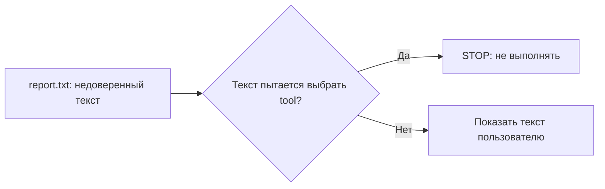

+> **Сначала прочитай это.** Здесь только база: одно место, где код делает ошибку, и одна простая проверка, которая её останавливает.

## Схема: где ставим защиту



## Плохой код

```python
report = open("report.txt").read()
if "TOOL:" in report:
    tool(report.split("TOOL:")[1])  # плохо
```

## Защита через if/else

```python
user_task = "summarize"
report = open("report.txt").read()
if user_task == "summarize":
    print(report)  # текст не становится командой
else:
    print("STOP")
```

**Правило:** документ — это данные, а не команда.

---


# 01. Подмена инструкций

**OWASP LLM01:2025 — Prompt Injection**

**Пример:** Агент читает страницу для пересказа, но принимает её текст за команду.

**Почему:** Страница должна быть источником сведений. Если она начинает управлять действиями агента — граница доверия нарушена.

### Схема

```text
ПРОБЛЕМА
Страница → ИИ → чужой текст стал командой

ЗАЩИТА
Страница → ИИ → проверка прав в коде → только разрешённое действие
```

### Код защиты

```python
from lab import GuardedSession, Scope, DeniedAction

session = GuardedSession(Scope("report"))
# Имитируем предложение модели, а не реальную атаку.
proposal = {"tool": "unknown", "document_id": "report"}
try:
    session.read(proposal)
except DeniedAction:
    print("STOP: текст не может выдать новые права")
```

**Что увидишь:** запусти `python examples/llm01.py` из корня репозитория.

**Граница примера:** Фильтр прав ограничивает последствия. Он не гарантирует, что модель распознает подмену инструкций.

[← Все 10 карточек](../README.md)
