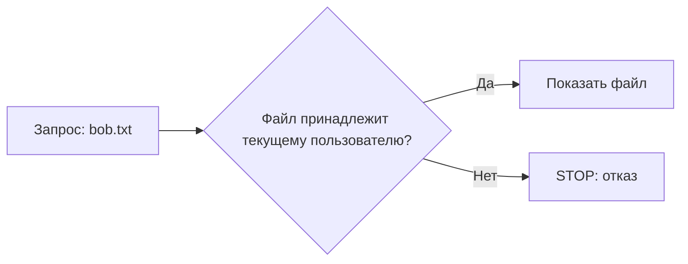

+> **Сначала прочитай это.** Здесь только база: одно место, где код делает ошибку, и одна простая проверка, которая её останавливает.

## Схема: где ставим защиту



## Плохой код

```python
files = {"alice.txt": "Мой", "bob.txt": "Чужой"}
print(files["bob.txt"])  # плохо
```

## Защита через if/else

```python
user = "alice"
requested = "bob.txt"
if requested == user + ".txt":
    print(files[requested])
else:
    print("STOP: чужой файл")
```

**Правило:** сначала проверка, потом действие.

---


# 02. Утечка приватных данных

**OWASP LLM02:2025 — Sensitive Information Disclosure**

**Пример:** Бот отвечает пользователю, добавляя сведения из чужого документа.

**Почему:** Если лишние данные уже попали в контекст ИИ, просьба «не показывай их» — слабая защита.

### Схема

```text
ПРОБЛЕМА
Чужие данные → контекст ИИ → ответ пользователю

ЗАЩИТА
Проверка доступа → только свои данные → контекст ИИ
```

### Код защиты

```python
# user_id приходит из проверенной сессии, а не из ответа ИИ.
user_id = "alice"
records = [
    {"owner": "alice", "text": "Мой учебный отчёт"},
    {"owner": "bob", "text": "Чужой учебный отчёт"},
]
context = [r["text"] for r in records if r["owner"] == user_id]
assert context == ["Мой учебный отчёт"]
print(context)
```

**Что увидишь:** запусти `python examples/llm02.py` из корня репозитория.

**Граница примера:** В настоящем сервисе доступ проверяет сервер до чтения данных; здесь показана логика на фиктивном списке.

[← Все 10 карточек](../README.md)
