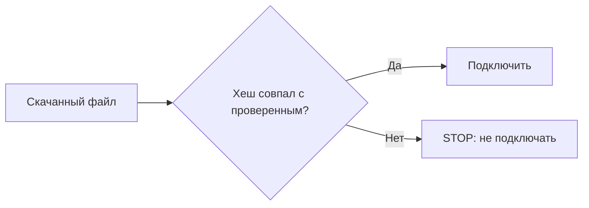

+> **Сначала прочитай это.** Здесь только база: одно место, где код делает ошибку, и одна простая проверка, которая её останавливает.

## Схема: где ставим защиту



## Плохой код

```python
downloaded = get_file()
load(downloaded)  # плохо: ничего не проверили
```

## Защита через if/else

```python
actual_hash = sha256(downloaded)
if actual_hash == expected_hash:
    load(downloaded)
else:
    print("STOP: файл изменился")
```

**Правило:** сначала проверка, потом действие.

---


# 03. Ненадёжные зависимости

**OWASP LLM03:2025 — Supply Chain**

**Пример:** Ты подключил библиотеку или файл модели. Их содержимое изменилось без твоего ведома.

**Почему:** ИИ-приложение зависит от чужих компонентов. Ошибка или подмена компонента затрагивает всё приложение.

### Схема

```text
ПРОБЛЕМА
Непроверенный компонент → приложение → риск

ЗАЩИТА
Доверенный источник + закреплённая версия + проверка → загрузка
```

### Код защиты

```python
import hashlib

# Фиктивный артефакт и заранее одобренный эталон.
approved = b"reviewed-demo-component-v1"
trusted_digest = hashlib.sha256(approved).hexdigest()
downloaded = b"reviewed-demo-component-v1"
if hashlib.sha256(downloaded).hexdigest() != trusted_digest:
    raise ValueError("STOP: файл изменился")
print("Файл совпадает с одобренным")
```

**Что увидишь:** запусти `python examples/llm03.py` из корня репозитория.

**Граница примера:** Хеш доказывает совпадение, а не безопасность. Эталон получают отдельно из доверенного источника; ещё нужны проверка происхождения и обновления.

[← Все 10 карточек](../README.md)
