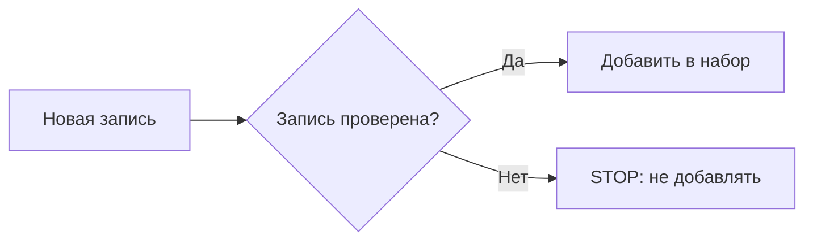

+> **Сначала прочитай это.** Здесь только база: одно место, где код делает ошибку, и одна простая проверка, которая её останавливает.

## Схема: где ставим защиту



## Плохой код

```python
dataset.append(new_row)  # плохо: источник неизвестен
train(dataset)
```

## Защита через if/else

```python
if new_row["reviewed"] is True:
    dataset.append(new_row)
else:
    print("STOP: запись не проверена")
```

**Правило:** сначала проверка, потом действие.

---


# 04. Отравленные данные

**OWASP LLM04:2025 — Data and Model Poisoning**

**Пример:** В учебный набор попали неверные примеры. Модель учится отвечать неправильно.

**Почему:** Если испортить данные обучения, можно испортить поведение модели. Похожие проблемы бывают у базы знаний.

### Схема

```text
ПРОБЛЕМА
Испорченные примеры → обучение → плохие ответы

ЗАЩИТА
Происхождение + проверка набора → обучение → оценка результата
```

### Код защиты

```python
# Метаданные выставляет наш процесс проверки, не автор записи.
rows = [
    {"text": "Проверенный пример", "source": "curated", "reviewed": True},
    {"text": "Непроверенный пример", "source": "unknown", "reviewed": False},
]
approved = [
    r["text"] for r in rows
    if r["source"] == "curated" and r["reviewed"] is True
]
assert approved == ["Проверенный пример"]
print(approved)
```

**Что увидишь:** запусти `python examples/llm04.py` из корня репозитория.

**Граница примера:** Это пропускной фильтр набора, не детектор отравления. Даже одобренные данные требуют проверки содержания и оценки модели.

[← Все 10 карточек](../README.md)
