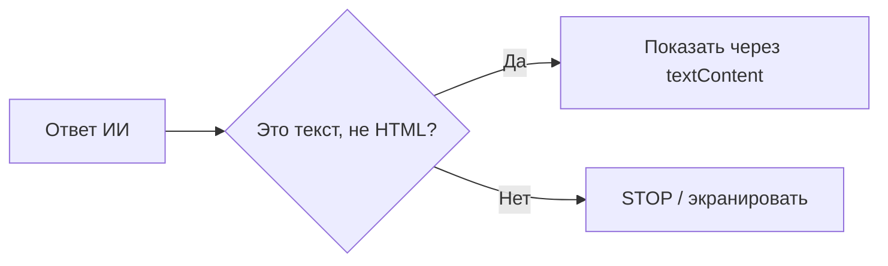

+> **Сначала прочитай это.** Здесь только база: одно место, где код делает ошибку, и одна простая проверка, которая её останавливает.

## Схема: где ставим защиту



## Плохой код

```python
answer = model_answer()
page.innerHTML = answer  # плохо
```

## Защита через if/else

```python
answer = model_answer()
if len(answer) <= 1000:
    page.textContent = answer
else:
    print("STOP: слишком большой ответ")
```

**Правило:** сначала проверка, потом действие.

---


# 05. Опасная обработка ответа

**OWASP LLM05:2025 — Improper Output Handling**

**Пример:** Сайт вставляет ответ ИИ как HTML. Браузер воспринимает его как разметку.

**Почему:** Ответ модели — текст, которому нельзя автоматически доверять как коду.

### Схема

```text
ПРОБЛЕМА
Ответ ИИ → HTML без обработки → браузер меняет страницу

ЗАЩИТА
Ответ ИИ → экранирование → отображается обычный текст
```

### Код защиты

```python
from lab import render_text

model_output = "<label>Учебный пример</label>"
safe_html = render_text(model_output)
assert "&lt;label&gt;" in safe_html
print(safe_html)
```

**Что увидишь:** запусти `python examples/llm05.py` из корня репозитория.

**Граница примера:** Этот способ подходит для текста внутри HTML. Для SQL нужны параметры запроса; для команд — отказ от исполнения сгенерированного кода.

[← Все 10 карточек](../README.md)
