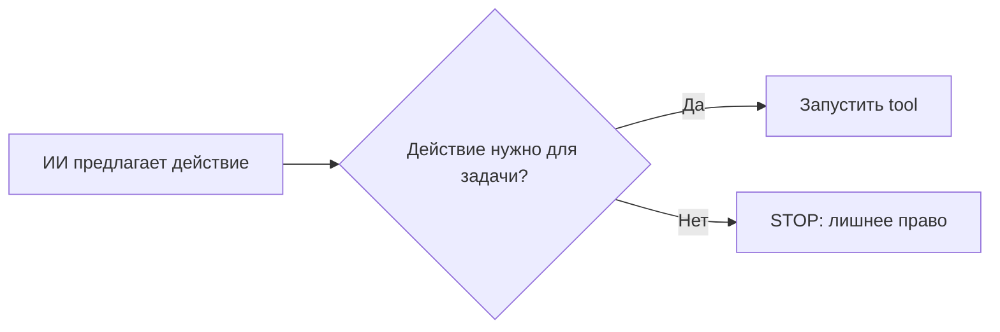

+> **Сначала прочитай это.** Здесь только база: одно место, где код делает ошибку, и одна простая проверка, которая её останавливает.

## Схема: где ставим защиту



## Плохой код

```python
model_choice = "delete"
tool(model_choice)  # плохо
```

## Защита через if/else

```python
user_task = "read_report"
model_choice = "delete"
if user_task == "read_report" and model_choice == "read":
    tool("read")
else:
    print("STOP: действие не разрешено")
```

**Правило:** сначала проверка, потом действие.

---


# 06. Слишком много полномочий

**OWASP LLM06:2025 — Excessive Agency**

**Пример:** Пользователь просит прочитать отчёт, а у агента есть ещё и право менять или отправлять данные.

**Почему:** Даже обычная ошибка модели опасна, когда ей доступно слишком много действий.

### Схема

```text
ПРОБЛЕМА
Задача: прочитать → агент с широкими правами → лишнее действие

ЗАЩИТА
Задача: прочитать → только чтение выбранного отчёта
```

### Код защиты

```python
from lab import GuardedSession, Scope

# Права задаёт приложение по задаче пользователя.
session = GuardedSession(Scope("report"))
text = session.read({
    "tool": "read_document",
    "document_id": "report",
})
print(text)  # Сессия предоставляет только разрешённое чтение.
```

**Что увидишь:** запусти `python examples/llm06.py` из корня репозитория.

**Граница примера:** LLM01 — откуда пришла чужая инструкция. LLM06 — почему у агента вообще есть опасные полномочия. Для важных изменений нужна отдельная проверка разрешений.

[← Все 10 карточек](../README.md)
