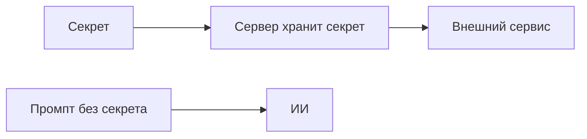

+> **Сначала прочитай это.** Здесь только база: одно место, где код делает ошибку, и одна простая проверка, которая её останавливает.

## Схема: где ставим защиту



## Плохой код

```python
prompt = "Ты помощник. API_KEY=secret"
model(prompt)  # плохо
```

## Защита через if/else

```python
prompt = "Ты помощник. Объясняй отчёт."
api_key = get_secret_from_server()
if api_key:
    server_call(api_key)
else:
    print("STOP: нет ключа")
```

**Правило:** сначала проверка, потом действие.

---


# 07. Утечка системного промпта

**OWASP LLM07:2025 — System Prompt Leakage**

**Пример:** Разработчик спрятал пароль в системном промпте, надеясь, что ИИ его не покажет.

**Почему:** Системный промпт помогает управлять ответами, но не является хранилищем секретов.

### Схема

```text
ПРОБЛЕМА
Секрет в промпте → модель видит секрет → возможная утечка

ЗАЩИТА
Секрет остаётся на сервере → модель получает только нужные данные
```

### Код защиты

```python
# Ни ключа, ни пароля в сообщениях модели.
system_prompt = "Кратко объясняй учебные отчёты."
messages = [
    {"role": "system", "content": system_prompt},
    {"role": "user", "content": "Объясни результат: status=ok"},
]
print(messages)
# Ключи для внешних сервисов использует серверный адаптер.
# Его настройки не добавляются в messages.
```

**Что увидишь:** запусти `python examples/llm07.py` из корня репозитория.

**Граница примера:** Скрытые инструкции тоже могут раскрыться. Поэтому права доступа и секреты нельзя защищать одной фразой «не рассказывай».

[← Все 10 карточек](../README.md)
