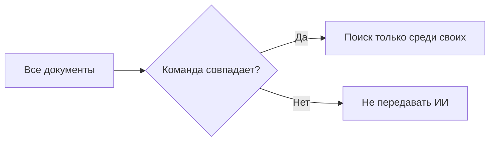

+> **Сначала прочитай это.** Здесь только база: одно место, где код делает ошибку, и одна простая проверка, которая её останавливает.

## Схема: где ставим защиту



## Плохой код

```python
context = similarity_search(all_chunks, query)
model(context)  # плохо
```

## Защита через if/else

```python
allowed = []
for chunk in all_chunks:
    if chunk["team"] == user_team:
        allowed.append(chunk)
context = similarity_search(allowed, query)
```

**Правило:** сначала проверка, потом действие.

---


# 08. Чужие документы в поиске

**OWASP LLM08:2025 — Vector and Embedding Weaknesses**

**Пример:** Поиск нашёл подходящий документ другой команды и передал его в ответ.

**Почему:** Похожесть текста не означает право его читать. RAG — это поиск документов перед ответом ИИ.

### Схема

```text
ПРОБЛЕМА
Общая база → поиск по похожести → чужой документ в контексте

ЗАЩИТА
Проверенная команда → фильтр доступа → поиск → разрешённые документы
```

### Код защиты

```python
# tenant берётся из проверенной сервером сессии.
tenant = "team-a"
chunks = [
    {"tenant": "team-a", "text": "Наш документ"},
    {"tenant": "team-b", "text": "Документ другой команды"},
]
# Сначала доступ, потом поиск внутри разрешённых данных.
allowed = [c for c in chunks if c["tenant"] == tenant]
hits = [c["text"] for c in allowed if "документ" in c["text"].lower()]
assert hits == ["Наш документ"]
print(hits)
```

**Что увидишь:** запусти `python examples/llm08.py` из корня репозитория.

**Граница примера:** Векторная база должна применять настоящий фильтр доступа до выдачи контекста. Здесь обычный список; качество embeddings и отравление индекса не проверяются.

[← Все 10 карточек](../README.md)
