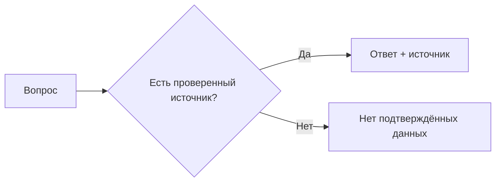

+> **Сначала прочитай это.** Здесь только база: одно место, где код делает ошибку, и одна простая проверка, которая её останавливает.

## Схема: где ставим защиту



## Плохой код

```python
answer = model("Сколько пользователей?")
print(answer)  # плохо: нет проверки
```

## Защита через if/else

```python
fact = database.get("users_count")
if fact is not None:
    print("Пользователей:", fact, "Источник: database")
else:
    print("Нет подтверждённых данных")
```

**Правило:** сначала проверка, потом действие.

---


# 09. Уверенная выдумка

**OWASP LLM09:2025 — Misinformation**

**Пример:** ИИ уверенно назвал число, которого нет в исходном отчёте.

**Почему:** Правдоподобный ответ не равен проверенному факту.

### Схема

```text
ПРОБЛЕМА
Вопрос → догадка ИИ → пользователь верит

ЗАЩИТА
Вопрос → проверяемый источник → факт или «нет данных»
```

### Код защиты

```python
# Фиктивные проверенные факты; свободную генерацию здесь не используем.
facts = {"report-1": {"count": 12}}
source_id = "report-1"
record = facts.get(source_id)
if record is None:
    answer = "Нет подтверждённых данных"
else:
    answer = f"Количество: {record['count']} (источник: {source_id})"
print(answer)
```

**Что увидишь:** запусти `python examples/llm09.py` из корня репозитория.

**Граница примера:** Ссылка сама по себе не доказывает утверждение. Здесь число берётся прямо из записи; свободный ответ нужно отдельно сверять с источником.

[← Все 10 карточек](../README.md)
