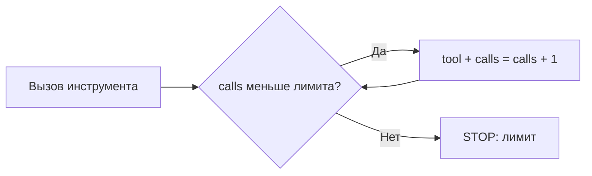

+> **Сначала прочитай это.** Здесь только база: одно место, где код делает ошибку, и одна простая проверка, которая её останавливает.

## Схема: где ставим защиту



## Плохой код

```python
while True:
    tool("search")  # плохо
```

## Защита через if/else

```python
calls = 0
max_calls = 3
while calls < max_calls:
    tool("search")
    calls += 1
print("STOP: лимит вызовов")
```

**Правило:** сначала проверка, потом действие.

---


# 10. Бесконечные действия и расходы

**OWASP LLM10:2025 — Unbounded Consumption**

**Пример:** Агент повторяет запросы и попытки, расходуя время и бюджет.

**Почему:** Без ограничения даже безобидная задача может превратиться в бесконечный цикл.

### Схема

```text
ПРОБЛЕМА
Задача → попытка → повтор → повтор → расходы

ЗАЩИТА
Задача → счётчик попыток → лимит достигнут → STOP
```

### Код защиты

```python
from lab import GuardedSession, Scope, DeniedAction

session = GuardedSession(Scope("report", max_calls=1))
request = {"tool": "read_document", "document_id": "report"}
session.read(request)
try:
    session.read(request)
except DeniedAction:
    print("STOP: лимит попыток исчерпан")
```

**Что увидишь:** запусти `python examples/llm10.py` из корня репозитория.

**Граница примера:** Это лимит инструментов в одной сессии. В продакшене отдельно ограничивают время, токены, деньги, параллельность и повторные запросы.

[← Все 10 карточек](../README.md)
